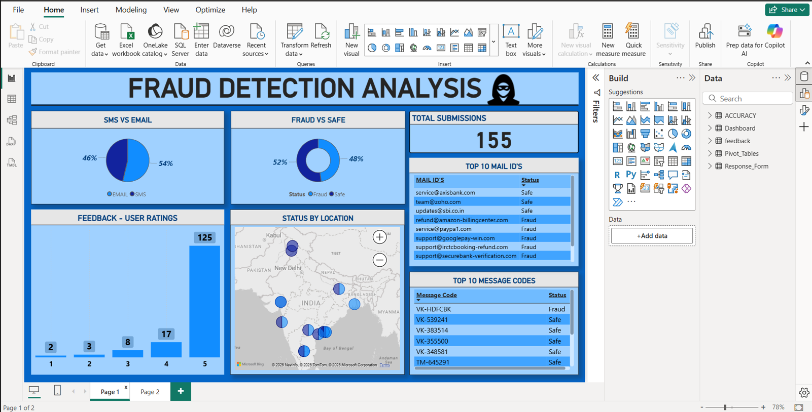

# Automated Fraud Detection & Analysis System

This project implements an end-to-end automated system for detecting and analyzing fraudulent SMS and email messages. Users can submit suspicious messages through a simple form, and the system uses an AI model to classify them. The results are then logged and visualized in a real-time Power BI dashboard.

The entire workflow is orchestrated using the Microsoft Power Platform (SharePoint, Power Automate, and Power BI).

## 🚀 Features

- **User-Friendly Submission Form**: An easy-to-use form for users to report suspicious content.
- **Automated Email Notifications**: Instantaneous warning emails upon submission and a final verdict email after analysis.
- **AI-Powered Classification**: Utilizes a pre-trained AI model within Power Automate to classify submissions as "Fraud" or "Safe".
- **Centralized Data Logging**: All submissions and their outcomes are stored securely in a SharePoint List.
- **Interactive Dashboard**: A comprehensive Power BI dashboard provides insights into the collected data, showing trends, key metrics, and geographical information.

## 🛠️ Tech Stack

- **Data Collection**: Microsoft Forms / SharePoint List
- **Workflow Automation**: Power Automate
- **AI/ML**: Pre-trained AI Model (integrated within Power Automate)
- **Data Storage**: SharePoint Lists
- **Data Visualization**: Power BI

## ⚙️ How It Works

The system follows a simple yet powerful automated workflow:

1.  **Submission**: A user receives a suspicious email or SMS and submits its details (e.g., sender's email ID, message content, SMS code) through a dedicated form.
2.  **Instant Alert**: As soon as the form is submitted, a Power Automate flow is triggered, which immediately sends a precautionary warning email to the user, advising them not to click any links or share personal information.
3.  **AI Analysis**: The Power Automate flow then passes the submitted data to a trained AI model, which analyzes the content and classifies it as either "Fraud" or "Safe".
4.  **Verdict & Logging**: The classification result is logged back into the SharePoint List, and a final verdict email is sent to the user informing them of the outcome.
5.  **Visualization**: The SharePoint List serves as a live data source for the Power BI dashboard. The dashboard automatically refreshes to display the latest data, providing a comprehensive overview of all submissions.

## 📊 Dashboard Overview

The Power BI dashboard provides a centralized view of the fraud detection analysis with several key insights:

- **Total Submissions**: A key performance indicator (KPI) card showing the total number of reports submitted by users (155).
- **SMS vs Email**: A pie chart breaking down the source of submissions, indicating whether they came from email (46%) or SMS (54%).
- **Fraud vs Safe**: A donut chart showing the overall classification results, with 52% of submissions identified as Fraud and 48% as Safe.
- **Feedback - User Ratings**: A bar chart displaying user satisfaction with the system. A vast majority (125 users) have given a 5-star rating, indicating high satisfaction.
- **Status by Location**: A map visualization showing the geographic origins of the submissions, helping to identify region-specific campaigns.
- **Top 10 Mail IDs & Message Codes**: Two tables that list the most frequently reported email addresses and SMS sender codes, along with their fraud status. This is crucial for identifying repeat offenders and common scam patterns.
