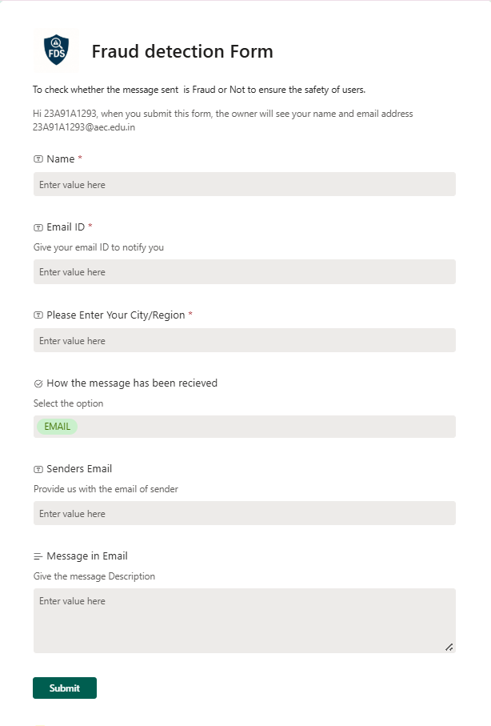
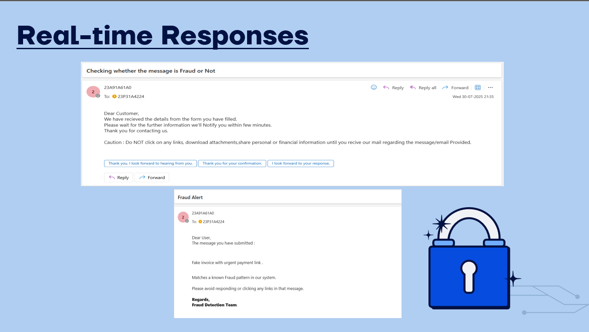

Automated Fraud Detection & Analysis System

This project implements an end-to-end automated system for detecting and analyzing fraudulent SMS and email messages. Users can submit suspicious messages through a simple form, and the system uses an AI model to classify them. The results are then logged, user feedback is collected, and everything is visualized in a real-time Power BI dashboard.

The entire workflow is orchestrated using the Microsoft Power Platform (SharePoint, Power Automate, and Power BI).

## 🚀 Features

- **User-Friendly Submission Form**: An easy-to-use form for users to report suspicious content.
- **Automated Email Notifications**: Instantaneous warning emails upon submission and a final verdict email after analysis.
- **AI-Powered Classification**: Utilizes a pre-trained AI model within Power Automate to classify submissions as "Fraud" or "Safe".
- **Centralized Data Logging**: All submissions and their outcomes are stored securely in a SharePoint List.
- **Integrated Feedback Loop**: A feedback form link is included in the final verdict email, allowing users to rate the service.
- **Interactive Dashboard**: A comprehensive Power BI dashboard provides insights into the collected data, showing trends and user satisfaction ratings.

## 🛠️ Tech Stack

- **Data Collection**: Microsoft Forms / SharePoint List
- **Workflow Automation**: Power Automate
- **AI/ML**: Pre-trained AI Model (integrated within Power Automate)
- **Data Storage**: SharePoint Lists
- **Data Visualization**: Power BI

## ⚙️ How It Works

The system follows a simple yet powerful automated workflow:

1.  **Submission**: A user receives a suspicious email or SMS and submits its details through a dedicated form.
2.  **Instant Alert**: As soon as the form is submitted, a Power Automate flow is triggered, which immediately sends a precautionary warning email.
3.  **AI Analysis**: The flow then passes the submitted data to an AI model, which classifies it as either "Fraud" or "Safe".
4.  **Verdict & Logging**: The classification result is logged back into the SharePoint List.
5.  **Feedback Collection**: A final verdict email is sent to the user informing them of the outcome and includes a link to a feedback form.
6.  **Visualization**: The SharePoint List and feedback responses serve as live data sources for the Power BI dashboard.

## 📸 System in Action: A Visual Walkthrough

Here is a visual breakdown of the key components of the system.

### 1. The Submission Form
This is the starting point for the user. They enter the details of the suspicious message into this simple and clean form.

### 2. The Automation Engine (Power Automate)
This flow is the heart of the project. It triggers on a new form submission and automates every step: sending emails, calling the AI model, and logging the results.

### 3. Data Logging (SharePoint List)
All results from the AI analysis are automatically recorded in a structured SharePoint list, which acts as the database for our dashboard.

### 4. User Feedback Form
After the analysis is complete, users receive a link to this form to provide a rating and feedback on the service.

## 📊 Final Result: The Power BI Dashboard

All the collected data is fed into this interactive Power BI dashboard, providing a real-time, comprehensive overview of fraud attempts and user satisfaction.

---

*This README was generated by Decide AI.*
